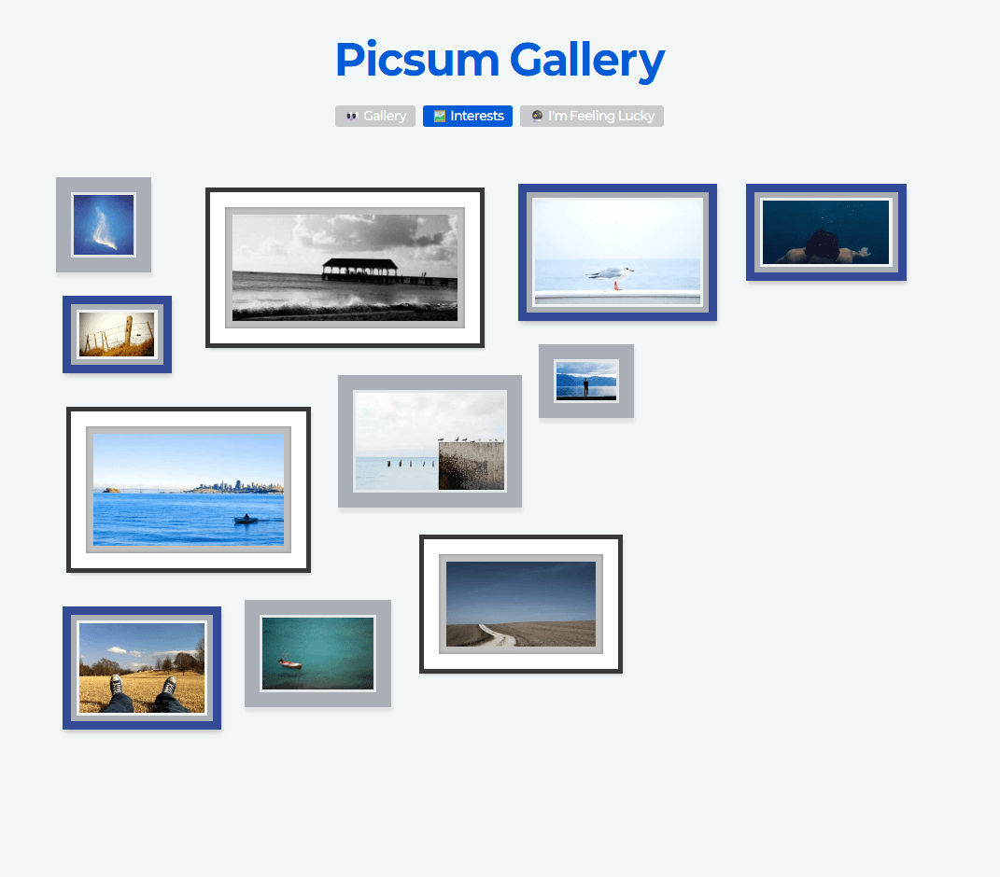
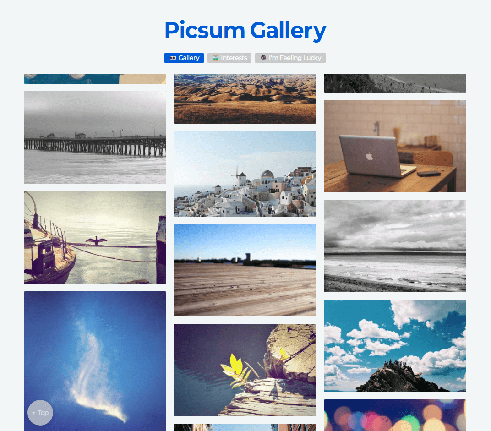
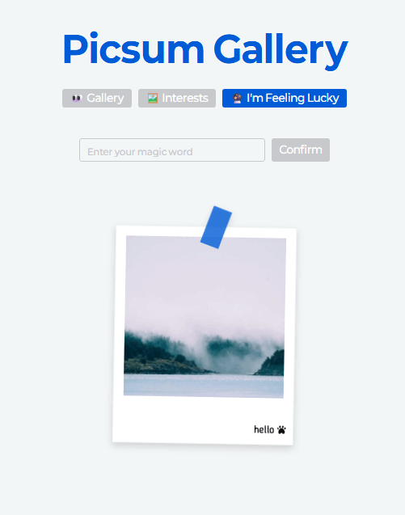

## 👀 Picsum Gallery



Picsum Gallery의 이미지 목록을 둘러보고 흥미로운 사진을 나만의 벽에 전시해보세요!

### 소개

핀터레스트 스타일의 무한 스크롤 이미지 목록을 직접 구현하고, 갤러리라는 컨셉에 맞춰 몇 가지 재미있는 기능을 추가했습니다.

사용자가 흥미롭게 스크롤하며 이미지를 탐색하고, 선택하여 나만의 전시 공간을 구성하는 상호작용 중심의 UI를 구현했습니다.

사용 스택:
Typescript, React, TanStack Query, Zustand, [MaxRectsPacker](https://www.npmjs.com/package/maxrects-packer), React Router Dom, GSAP, Tailwind CSS
사용 API: https://picsum.photos/

### 실행

```js
npm install
npm run build
npm run preview
```

### 주요 기능

**Masonry 레이아웃**


핀터레스트 스타일 이미지 정렬, 즉 Masonry 레이아웃은 이전에 [다른 프로젝트](https://www.ba-ton.kr/) 에서 라이브러리를 사용해서 구현한 적이 있기 때문에 이번에는 직접 계산하는 방식으로 제작했습니다.

```js
 const items = Array.from(container.children) as HTMLElement[];
   const colHeights = new Array(cols).fill(0);

   // 부드러운 레아아웃 적용을 위해
   requestAnimationFrame(() => {
     items.forEach((item) => {
       // 현재 가장 짧은 col의 인덱스를 찾아서 이미지를 배치
       let minCol = 0;
       for (let c = 1; c < cols; c++) {
         if (colHeights[c] < colHeights[minCol]) minCol = c;
       }

       item.style.width = `${colWidth}px`;
       item.style.left = `${minCol * colWidth}px`;
       item.style.top = `${colHeights[minCol]}px`;

       // 이미지의 비율 기반 높이 계산
       const ratio = parseFloat(item.dataset.ratio || "1");
       const height = colWidth / ratio;
       colHeights[minCol] += height;
     });

     container.style.height = `${Math.max(...colHeights)}px`;

     ...
```

디바이스 너비에 따라 반응형으로 column 수를 자동 계산하고,
각 이미지의 가로세로 비율(aspect-ratio)에 맞춰 가장 짧은 열에 배치합니다.

이 과정에서 requestAnimationFrame과 transition을 사용해 부드럽고 안정적인 배치 애니메이션을 구현했습니다.
디바이스 너비가 바뀌더라도 자연스럽게 레이아웃을 재배치합니다.

**무한스크롤**

```js
// 로드 트리거가 화면에 보이는 경우 다음 페이지 로드
const observer = new IntersectionObserver((entries) => {
  const target = entries[0];
  if (target.isIntersecting && hasNextPage && !isFetchingNextPage) {
    fetchNextPage();
  }
});

observer.observe(loadMoreRef.current);
```

IntersectionObserver를 이용해 투명한 더보기 버튼이 화면에 들어올 때 자동으로 다음 페이지를 요청합니다.

```js
const useInfiniteImages = () => {
  const query = useInfiniteQuery({
    queryKey: ["images"],
    queryFn: ({ pageParam = 1 }) => fetchImagesByPageFn(pageParam),
    initialPageParam: 1,
    getNextPageParam: (last, all) => {
      //다음 페이지 번호를 계산
      return last.length ? all.length + 1 : undefined;
    },
  });

  // masonry 적용 가능하게 데이터 배열을 flatten 후 반환
  const images = query.data?.pages.flat() ?? [];

  return {
    ...query,
    images,
  };
};
```

React Query의 useInfiniteQuery를 사용해 API 요청을 캐싱하고 페이지 단위로 데이터를 관리합니다.

무한 스크롤 구조상 데이터 배열이 중첩되므로 렌더링 시점에는 pages.flat()을 통해 1차원 배열로 변환하여 처리했습니다.

**스크롤 복원**

무한 스크롤은 탐색이 쉽고 몰입이 용이하다는 장점이 있지만 그만큼 흐름 관리가 중요하다고 생각합니다.

탐색 도중 상세 페이지 이동 후 다시 목록 복귀시 스크롤 위치가 초기화 되는 현상이 가장 큰 UX 문제가 될 수 있습니다.

이 문제를 해결하기 위해 React Query 캐시에 스크롤 상태를 직접 저장하고,
페이지 복귀 시점에 Masonry 레이아웃 계산이 끝날 때까지 기다린 후 스크롤을 복원했습니다.

```js
  const saveScrollState = (y: number) => {
      if (!query.data) return;

      queryClient.setQueryData(["images", "scroll"], {
        scrollY: y,
        pageCount: query.data.pages.length,
        timestamp: Date.now(),
      });
    };

    const restoreScrollState = async (
      layoutReadyRef: React.RefObject<(() => void) | null>
    ) => {
      const scrollData = queryClient.getQueryData<{
        scrollY: number;
        pageCount: number;
      }>(["images", "scroll"]);

      if (!scrollData) return;

      // 필요한 페이지 수까지 fetchNextPage 실행
      while ((query.data?.pages.length ?? 0) < scrollData.pageCount) {
        await query.fetchNextPage();
      }

      //masonry 계산을 기다리기
      await new Promise<void>((resolve) => {
        layoutReadyRef.current = resolve;
      });

      // paint 단계가 끝나기를 기다림
      await new Promise<void>((resolve) =>
        requestAnimationFrame(() => requestAnimationFrame(() => resolve()))
      );

      // 모든 작업 끝난 후 스크롤 복원
      window.scrollTo({
        top: scrollData.scrollY,
        behavior: "instant" as ScrollBehavior,
      });
    };

    return {
      ...query,
      images,
      saveScrollState,
      restoreScrollState,
    };
  };
```

[올리브영 테크 팀 블로그](https://oliveyoung.tech/2025-07-30/scroll-restoration/)의 로직을 참고해서 query에 스크롤 관련 데이터를 저장했습니다.

레이아웃 계산을 기다리는 layoutReadyRef 플래그와 더블 requestAnimationFrame을 이용해 paint 단계 이후의 프레임까지 기다려 실제 브라우저 화면에 이미지가 완전히 배치된 뒤 복원을 적용했습니다.

**선택 이미지 스토어**

```js
export const useSelectedImageStore = create<SelectedImageStore>((set, get) => ({
selectedIds: new Set(),
maxSelected: 30, //최대 보관 개수
toggleId: (id, silent = false) => {
  const tmp = new Set(get().selectedIds);
  const max = get().maxSelected;

  if (tmp.has(id)) tmp.delete(id);
  else {
    if (tmp.size >= max) {
      const oldest = tmp.values().next().value;
      if (oldest) tmp.delete(oldest); //가장 오래된 값을 제거
    }
    tmp.add(id);
  }

  if (!silent) set({ selectedIds: tmp }); //리렌더 트리거를 위해 새 set로 생성
  else get().selectedIds = tmp;
},
clear: () => set({ selectedIds: new Set() }),
isSelected: (id) => get().selectedIds.has(id),

...
```

Zustand를 사용해 선택된 이미지를 관리하는 글로벌 스토어를 구성했습니다.
빠른 검색도 중요하고, 선택적으로 업데이트를 트리거하는 것이 필요했기 때문에 배열 대신 set 데이터 타입을 사용했습니다.
최대 30개의 이미지만 유지하도록 개수 초과시 오래된 id를 제거합니다.

silent 플래그를 이용해 일부 상태 변경 시 리렌더링을 의도적으로 방지하여
UI를 유지하면서 데이터를 업데이트 했습니다.
선택된 이미지는 이후 Interests 섹션에서 액자 형태로 배치합니다.

**액자 배치**


```js
function packImages(images: GalleryImage[]): Rect<GalleryImage>[] {
  const wall = wallRef.current;
  if (!wall) return [];

  const gap = 50; //이미지 사이 간격 값
  const packer = new MaxRectsPacker(
    wall.clientWidth,
    wall.clientHeight - 100,
    gap,
    {
      smart: false,
      square: false,
    }
  );

  for (const img of images) {
    // 랜덤 비율로 이미지를 축소 & 디바이스 너비에 따라 배율 조절
    const randomRatio =
      window.innerWidth < 539
        ? Math.floor(Math.random() * (50 - 20 + 1)) + 20
        : Math.floor(Math.random() * (30 - 15 + 1)) + 15;

    // 배율대로 축소하되 최소 너비는 70으로 보장
    const scaledWidth = Math.max(70, img.width / randomRatio);

    packer.add(scaledWidth, scaledWidth / (img.width / img.height), img);
  }

  return packer.bins[0].rects ?? [];
}
```

선택된 이미지를 다양한 크기의 액자로 벽에 배치하기 위해 Maximum rectangles 알고리즘을 활용했습니다. 해당 알고리즘을 구현한 가벼운 라이브러리 [maxrects-packer](https://www.npmjs.com/package/maxrects-packer)를 사용했습니다.

빈 공간을 직사각형 단위로 관리하며, 새 이미지를 추가할 때마다 공간을 쪼개 최적 배치를 수행합니다.

추가로 이미지의 원본 비율을 유지하면서 랜덤 비율로 축소하고 비율은 화면 너비에 따라 조절해서 공간의 밸런스를 맞췄습니다.

```js
tl.to(frame, {
  y: `+=${dropDist}`,
  rotationZ: rotZ,
  rotationX: rotX,
  duration: 0.9,
})
  .to(frame, {
    y: "-=5", //살짝 바운스
    rotationX: rotX * 0.9,
    duration: 0.15,
    ease: "power2.out",
  })
  .to(frame, {
    y: "+=12",
    rotationX: 90, //앞으로 쓰러트리기
    rotationZ: rotZ * 0.3,
    opacity: 0,
    duration: 0.6,
    ease: "power1.inOut",
  });
```

액자를 클릭하면 GSAP 기반의 3D 낙하 애니메이션으로 제거되며,
Zustand 스토어에서 silent 모드로 해당 ID를 제거해 UI 갱신 없는 자연스러운 삭제 효과를 구현했습니다.

### 최적화 과정

**이미지 최적화**

```js
  <figure
      key={img.id}
      data-ratio={ratio}
      style={{
        aspectRatio: ratio,
      }}
      className="group image-card bg-skeleton overflow-hidden p-1 lg:p-2 bg-clip-content pointer-events-none"
    >
       handleImageClick(img.id)}
        onLoad={(e) => (e.currentTarget.style.opacity = "1")}
        loading="lazy"
      />
```

srcSet / sizes 속성을 활용해 디바이스 크기에 맞는 이미지 해상도를 요청해 불필요하게 큰 용량을 방지했습니다.

loading="lazy"와 decoding="async"을 함께 사용하여 렌더 차단을 최소화하고 지연 로딩을 추가했습니다.

로딩 중엔 스켈레톤 UI를 표시하여 UX 저하를 방지합니다.

**React Query 캐싱**

```js
const useFetchImagesByIds = (ids: Set<string>) =>
    useQueries({
      queries: [...ids].map((id) => ({
        queryKey: ["image", id],
        queryFn: () => fetchImageByIdFn(id),
        enabled: !!id,
        keepPreviousData: true, //기존 캐시를 유지 해서 언마운트방지
      })),
      combine: (results) => {
        return {
          //아직 fetching 중인 이미지가 반환되지 않도록 데이터 필어터링
          data: results
            .map((result) => result.data)
            .filter((img): img is GalleryImage => !!img),
          isFetching: results.some((r) => r.isFetching),
          isError: results.some((r) => r.isError),
        };
      },
    });
```

모든 API 요청은 TanStack Query로 관리되며, useQuery, useInfiniteQuery 외에도 useQueries를 활용해서 다중 id 병렬 요청 구조를 사용했습니다.

**기타 최적화**

열 개수를 브라우저 너비에 따라 동적 계산

Masonry 연산 시 requestAnimationFrame으로 부드럽게 적용

디바운스/쓰로틀을 통한 스크롤 이벤트 부하 감소

로딩 스피너, 스켈레톤, 반응형 레이아웃 등 사용자 체감 품질 개선

### 추가 기능

**랜덤 포토카드**


```js
const useFetchImageBySeed = (seed: string) =>
  useQuery({
    queryKey: ["images", seed],
    queryFn: () => fetchImageBySeedFn(seed),
    enabled: !!seed,
  });

<form onSubmit={handleSubmit}>
  <div className="flex flex-row gap-2">
    <input
      id="lucky-input"
      type="text"
      value={input}
      required
      title="마법의 단어를 입력해주세요"
      onChange={(e) => setInput(e.target.value)}
      placeholder="Enter your magic word"
    />
    <button type="submit">
      <span>Confirm</span>
    </button>
  </div>
</form>;
```

Picsum의 seed 기반 엔드포인트를 이용해
사용자가 단어를 입력하면 해당 시드를 기반으로 이미지를 가져옵니다.

결과 이미지는 폴라로이드 카드 스타일을 추가해서 갤러리의 기념품 느낌으로 만들었습니다.

### 프로젝트 회고

데이터 관리와 무한 스크롤 구조를 직접 설계하면서 성능과 사용자 경험을 함께 고려했습니다.
구현하고 싶은 기능이 많아 시간에 쫓긴 것이 아쉽지만 레이아웃 계산과 스크롤 복원 과정을 최적화하며 한 페이지 안에서의 자연스러운 흐름을 연구하고 많이 배운 시간이었습니다.
